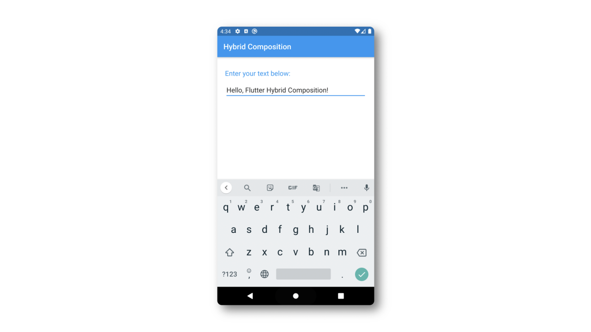

# Flutter Hybrid Composition

A demonstration of using [Hybrid Composition](https://github.com/flutter/flutter/wiki/Hybrid-Composition#android) facilities on Android platforms.

## Background
Starting from **Flutter 1.20.0**, the hybrid composition can be used on Android. This new feature fixes [most of the issues](https://github.com/flutter/flutter/wiki/Android-Platform-Views#associated-problems-and-workarounds) with the existing platform view approach. In particular, **accessibility** and **keyboard** related issues.

In previous versions of Flutter, the application runs with an issue that the keyboard cannot pop up properly with native EditText included in Flutter plugins. Now, with Hybrid Composition, this issue has been fixed. Here is the link of the issue:

[https://github.com/flutter/flutter/issues/55046](https://github.com/flutter/flutter/issues/55046)

## Purpose
This sample application mainly illustrates how to pack an **EditText** into a Flutter plugin and represents it in a Flutter application.

## Test
This demonstration has been tested on:

- OnePlus 3T, Android 7.1.1
- OnePlus 5, Android 7.1.1
- OnePlus 7, Android 10
- Pixel 3, Android 10
- Android Emulator, Android 10
